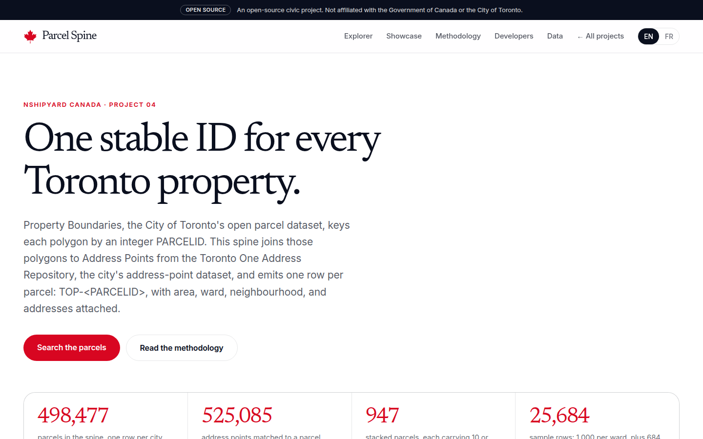
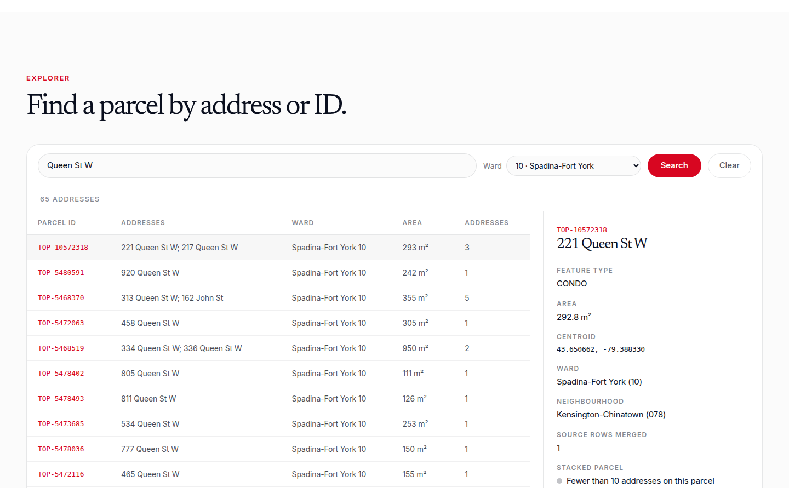
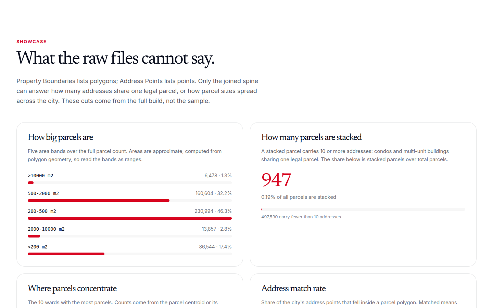

# Toronto Parcel Spine

One stable ID for every Toronto property: `TOP-<PARCELID>`.

Property Boundaries, the City of Toronto's open parcel dataset, keys each polygon by an integer `PARCELID`. This spine joins those polygons to Address Points from the Toronto One Address Repository, the city's address-point dataset, and emits one row per parcel, with area, ward, neighbourhood, and addresses attached. The site offers a search explorer, a showcase of cuts the raw files cannot answer, a methodology section, REST endpoints, and MCP tools for AI agents.

This is Nshipyard Canada project 04 of 08, built by Nshipyard, an independent open-source software lab. It is an open-source civic project, not affiliated with the Government of Canada or the City of Toronto.

## The ID scheme

`TOP-<PARCELID>`: `TOP` stands for Toronto Open Parcel, and `PARCELID` is the city's own integer parcel key from Property Boundaries. The ID stays stable as long as the city keeps `PARCELID` stable across data vintages; if the city renumbers a parcel, the TOP id changes with it. Repeated `PARCELID`s (multi-part geometries) are merged into one spine row, and `source_rows` counts the parts that were merged.

## Methodology summary

- One spine row per unique `PARCELID` in Property Boundaries; multi-part geometries are merged.
- Areas are approximate, computed with an equirectangular projection centred on Toronto. `stated_area` keeps the city's own figure when one was published.
- Addresses join parcels by point-in-polygon. Ward comes from the address record when present, otherwise from the parcel centroid.
- `flag_stacked` marks parcels with 10 or more addresses: condos and multi-unit buildings sharing one legal parcel.
- The full `parcel_spine.csv` is not committed (size). `data/parcel_spine_sample.csv` is a 25,684-row stratified sample: 1,000 rows per ward plus 684 parcels the build could not place in a ward, which powers the site's explorer and API.
- Full build notes live in `data/summary.json` under `methodology_notes`.

## Data

- `data/parcel_spine_sample.csv` - 25,684 sampled parcels (committed). Columns: `parcel_id`, `parcelid_src`, `feature_type`, `area_m2`, `stated_area`, `centroid_lat`, `centroid_lng`, `ward`, `ward_name`, `hood158_code`, `hood158_name`, `address_count`, `addresses` (pipe-separated sample), `source_rows`, `flag_stacked`, `lineage`.
- `data/summary.json` - totals, breakdowns, and methodology notes for the full build (committed).
- `data/parcel_spine.csv` - the full spine (built locally by `scripts/build_data.py`, never committed).
- `scripts/build_data.py` - the build pipeline: fetches Property Boundaries and Address Points from the City of Toronto's open data portal, merges multi-part parcels, joins addresses by point-in-polygon, and writes the full CSV, the stratified sample, and the summary.

## API

REST, served from the app:

| Method | Path | Description |
|---|---|---|
| GET | `/api/v1/parcel/search?q=...&ward=..&limit=..` | Search the 25,684-row sample by address text or parcel ID, optionally filtered to one ward. `limit` defaults to 50, max 200. |
| GET | `/api/v1/parcel/lookup/{id}` | Full record for one parcel by `TOP-<PARCELID>`, case-insensitive. 404 on unknown IDs. |
| GET | `/api/v1/parcel/summary` | Totals, breakdowns, and methodology notes for the full build. |
| GET | `/api/openapi.json` | OpenAPI 3.1 spec for the above. |

MCP, for AI agents:

- `POST /mcp` - JSON-RPC 2.0 over streamable HTTP. Tools: `parcel_lookup` (full parcel record by ID), `parcel_search` (address text or ID, optional ward), `parcel_summary` (full-build totals and notes).

Example:

```json
{"jsonrpc":"2.0","id":1,"method":"tools/call",
 "params":{"name":"parcel_lookup","arguments":{"id":"TOP-1029384"}}}
```

## Screenshots





## Development

```bash
npm install
npm run dev      # http://localhost:3000
npx tsc --noEmit # typecheck
npm run build    # production build
```

## Author

**Richardson Dackam** - [X (@richardsondx)](https://x.com/richardsondx) · [GitHub](https://github.com/richardsondx)

## License

MIT.
